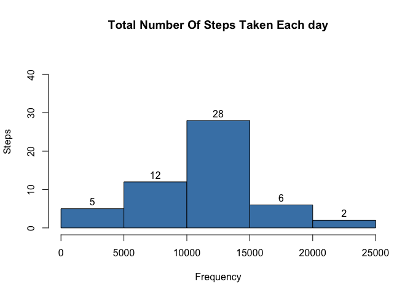
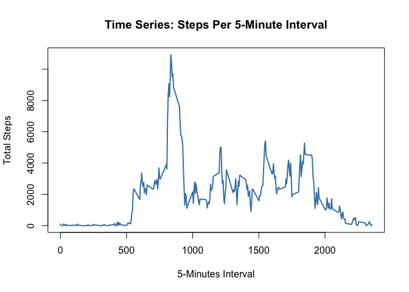
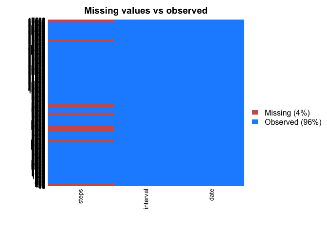
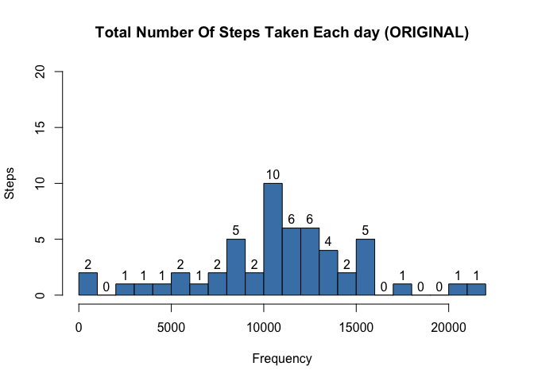
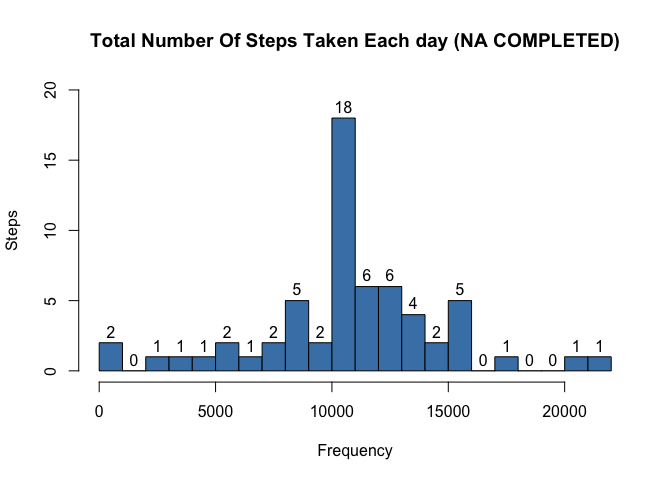
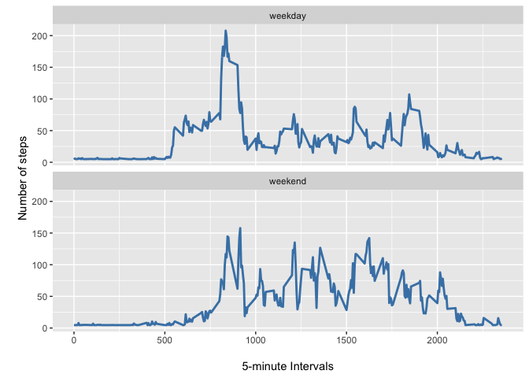

## 1. Loading and preprocessing the data

### 1.1 Load the data


```r
#libraries
```


```r
dataset <- read.csv("~/Downloads/Coursera_Reproducible_research/activity.csv")
str(dataset)
```

```
## 'data.frame':	17568 obs. of  3 variables:
##  $ steps   : int  NA NA NA NA NA NA NA NA NA NA ...
##  $ date    : Factor w/ 61 levels "2012-10-01","2012-10-02",..: 1 1 1 1 1 1 1 1 1 1 ...
##  $ interval: int  0 5 10 15 20 25 30 35 40 45 ...
```


## 2. What is mean total number of steps taken per day?

### 2.1 Calculate the total number of steps taken per day

```r
stepsPerDay <- aggregate(steps ~ date, dataset, FUN=sum)
```

### 2.2 Make a histogram of the total number of steps taken each day


```r
hist(stepsPerDay$steps,
     labels = TRUE,
     ylim=c(0, 45),
     main = "Total Number Of Steps Taken Each day",
     xlab = "Frequency",
     ylab = "Steps",
     col="SteelBlue",
     breaks=5)
```

<!-- -->

### 2.3 Calculate and report the mean and median of the total number of steps taken per day


```r
stepsMean <- round(mean(stepsPerDay$steps),2)
stepsMedian <- median(stepsPerDay$steps)
```
* Mean: 1.076619\times 10^{4}
* Median:  1.076619\times 10^{4}


## 3. What is the average daily activity pattern?

### 3.1 Make a time series plot of the 5-minute interval (x-axis) and the average number of steps taken, averaged across all days (y-axis)


```r
aggregatedInterval <- aggregate(steps ~ interval, dataset, FUN=sum)

plot(aggregatedInterval$interval, aggregatedInterval$steps, 
     type = "l", lwd = 2,
     xlab = "5-Minutes Interval", 
     ylab = "Total Steps",
     col="SteelBlue",
     main = "Time Series: Steps Per 5-Minute Interval")
```

<!-- -->

### 3.2 Which 5-minute interval, on average across all the days in the dataset, contains the maximum number of steps?

```r
aggregatedInterval[which.max(aggregatedInterval$steps),]
```

```
##     interval steps
## 104      835 10927
```

## 4. Imputing missing values

### 4.1 Calculate and report the total number of missing values in the dataset


```r
sapply(dataset,function(x) sum(is.na(x)))
```

```
##    steps     date interval 
##     2304        0        0
```


```r
library(Amelia)
```

```
## Loading required package: Rcpp
```

```
## ## 
## ## Amelia II: Multiple Imputation
## ## (Version 1.7.5, built: 2018-05-07)
## ## Copyright (C) 2005-2018 James Honaker, Gary King and Matthew Blackwell
## ## Refer to http://gking.harvard.edu/amelia/ for more information
## ##
```

```r
missmap(dataset, main = "Missing values vs observed")
```

<!-- -->

### 4.2 Devise a strategy for filling in all of the missing values in the dataset. The strategy does not need to be sophisticated. For example, you could use the mean/median for that day, or the mean for that 5-minute interval, etc.
### 4.3 Create a new dataset that is equal to the original dataset but with the missing data filled in.


```r
dataset2 <- dataset
meanstep <- round(mean(dataset$steps,na.rm = T))
dataset2$steps[is.na(dataset2$steps)] <- meanstep
knitr::kable(head(dataset2))
```


 steps  date          interval
------  -----------  ---------
    37  2012-10-01           0
    37  2012-10-01           5
    37  2012-10-01          10
    37  2012-10-01          15
    37  2012-10-01          20
    37  2012-10-01          25


### 4.4 Make a histogram of the total number of steps taken each day and Calculate and report the mean and median total number of steps taken per day. Do these values differ from the estimates from the first part of the assignment? What is the impact of imputing missing data on the estimates of the total daily number of steps?


```r
stepsPerDay2 <- aggregate(steps ~ date, dataset2, FUN=sum)
```


```r
hist(stepsPerDay$steps,
     labels = TRUE,
     ylim=c(0, 20),
     main = "Total Number Of Steps Taken Each day (ORIGINAL)",
     xlab = "Frequency",
     ylab = "Steps",
     col="SteelBlue",
     breaks=20)
```

<!-- -->


```r
hist(stepsPerDay2$steps,
     labels = TRUE,
     ylim=c(0, 20),
     main = "Total Number Of Steps Taken Each day (NA COMPLETED)",
     xlab = "Frequency",
     ylab = "Steps",
     col="SteelBlue",
     breaks=20)
```

<!-- -->

## 5. Are there differences in activity patterns between weekdays and weekends?

### 5.1 Create a new factor variable in the dataset with two levels – “weekday” and “weekend” indicating whether a given date is a weekday or weekend day.

```r
dataset3 <- dataset2    
dataset3$day <- NA
dataset3$day <- weekdays(as.Date(dataset3$date))
weekday <- c("Lundi","Mardi","Mercredi","Jeudi","Vendredi")
weekend <- c("Samedi","Dimanche")
dataset3$dateType <-  ifelse(as.POSIXlt(dataset3$date)$wday %in% c(0,6), 'weekend', 'weekday')
knitr::kable(head(dataset3))
```


 steps  date          interval  day     dateType 
------  -----------  ---------  ------  ---------
    37  2012-10-01           0  Lundi   weekday  
    37  2012-10-01           5  Lundi   weekday  
    37  2012-10-01          10  Lundi   weekday  
    37  2012-10-01          15  Lundi   weekday  
    37  2012-10-01          20  Lundi   weekday  
    37  2012-10-01          25  Lundi   weekday  
    

### 5.2 Make a panel plot containing a time series plot of the 5-minute interval (x-axis) and the average number of steps taken, averaged across all weekday days or weekend days (y-axis).


```r
meaninterval<- aggregate(steps ~ interval + dateType, dataset3, FUN=mean)

library(ggplot2)
ggplot(meaninterval, aes(x=interval, y=steps)) + 
  geom_line(color="SteelBlue", size=1) + 
  facet_wrap(~dateType, nrow=2) +
  labs(x="\n5-minute Intervals", y="\nNumber of steps")
```

<!-- -->
